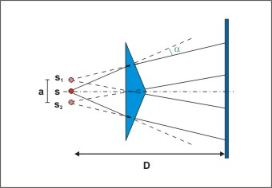
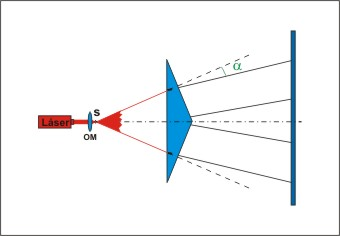

---
jupytext:
  text_representation:
    extension: .md
    format_name: myst
    format_version: 0.13
    jupytext_version: 1.11.5
kernelspec:
  display_name: Python 3 (system-wide)
  language: python
  metadata:
    cocalc:
      description: Python 3 programming language
      priority: 100
      url: https://www.python.org/
  name: python3
  resource_dir: /ext/jupyter/kernels/python3
---

# Biprisma de Fresnel

* Observación del diagrama interferencial producido por un biprisma de Fresnel.

* Determinación de la longitud de onda de la fuente láser empleada.

+++

Hay diferentes dispositivos que son equivalentes al sistema de dos rendijas originariamente empleado por Thomas Young. Aqui vamos a considerar el dispositivo llamado **biprisma de Fresnel**, el cual nos permitirá variar fácilmente la separación entre las rendijas o fuentes secundarias.

En la figura siguiente se muestra cómo el biprisma produce dos fuentes  secundarias de radiación equivalentes a las dos rendijas del dispositivo de Young. La luz que emerge por la parte superior del biprisma lo hace tal como si procediera de $S_1$, mientras que la parte del haz refractada por la parte inferior del biprisma se propaga como si procediera de $S_2$. Por lo tanto, a la derecha del biprisma tenemos la superposición de dos ondas esféricas procedentes de $S_1$ y $S_2$, respectivamente. El plano donde se encuentran estas fuentes virtuales es equivalente al plano de las rendijas en el experimento de Young. Además este plano coincide con la posición de la fuente real  $S$.



## Medida de la longitud de onda de emisión de un Láser de He-Ne con ayuda de un biprisma de Fresnel.

El dispositivo experimental con el que vamos a trabajar consiste en un láser de He-Ne, un objetivo de microscopio, un biprisma y una pantalla de observación situada al final del banco óptico. La luz procedente del láser se hace incidir sobre el objetivo de microscopio, $OM$, cuya función consiste en focalizar el haz de luz y obtener así una fuente casi puntual, $S$, como se muestra en la figura.



+++

Nuestro objetivo es hallar la longitud de onda $\lambda$ de la radiacion que ilumina el Biprisma de Fresnel utilizando la expresion de la interfranja,

$$Int = \frac{\lambda D}{a} \Rightarrow \lambda = \frac{Int \; a}{D}$$

siendo $D$ la distancia entre el plano que contiene a la doble rendija y la pantalla de observación, y $a$ la separación entre las dos rendijas. Para ello, primero mediremos la interfranja del patrón de interferencias generado cuando iluminamos con una fuente puntual el Biprisma de Fresnel para una distancia de trabajo $D$. A continuación, mediremos el valor de la separacion entre las fuentes virtuales $a$ y utilizaremos la anterior expresion para obtener $\lambda$.

------------

Al ejecutar la siguiente celda de código se presenta a la izquierda un esquema del montaje experimental: fuente puntual, biprisma de Fresnel (en rojo) y pantalla donde se visualizan las franjas de interferencia producidas por el biprisma. La distancia entre la fuente puntual y al pantalla está fijada a una valor de 1 m. La distancia entre la fuente y el biprisma puede ser modificada moviendo el desplazador que se muestra justo encima del esquema. A la derecha, se muestra el patrón de interferencias (completo y una imagen ampliada de 4 mm de longitud en la zona central del patrón), y el valor de la interfranja para la distancia fuente-biprisma selecionada. Moviendo el desplazador, se puede observar como cambia el patrón y el valor de la interfranja asociado.

+++

<font color='blue'> Recordatorio: Para ejecutar una celda de código y mostrar las simulaciones, se ha de seleccionar dicha celda y presionar el botón de *Run* que se encuentra en la parte superior del documento, o bien presionar a la vez *Mayúsculas + Enter*

```{code-cell} ipython3
%matplotlib inline


%run Biprisma_parte1.py
```

* Mueve el desplazador hasta encontrar una posición del biprisma en la que la interfranja sea aproximadamente igual a 0.5 mm. Anota el valor de la interfranja (en mm) y de la distancia fuente-biprisma (en m) seleccionados en la celda que aparece a continuación y ejecútala (Run).

```{code-cell} ipython3
# Escribe el valor de la interfranja y de la distancia fuente-biprisma obtenidos a continuación:
Interfranja = 0.49 # en mm
Dist_fuente_biprisma = 0.16# en m
```

Para medir la separacion entre las dos fuentes virtuales creadas por el biprisma colocamos una lente convergente después del biprisma. Esta lente formará una imagen real de las fuentes virtuales. La figura siguiente muestra el montaje que se llevaría a cabo en el laboratorio.


En la siguiente simulación, se plantea esta situación (ejecutar la siguiente celda de código). La figura a la izquierda reproduce el montaje experimental, pudiendo utilizar el desplazador para mover la posición de la lente. La figura de la derecha muestra lo que se vería en la pantalla. Cuando la lente se encuentre en su posición correcta, se formará la imagen de las dos fuentes virtuales en la pantalla. En la simulación, aparecerán los dos puntos más definidos y más pequeños. Finalmente, también se muestra el valor de la separación entre esas imagenes virtuales $a'$.

Se propone por tanto mover la lente hasta que las imágenes se vean lo más nítidas posibles, lo que nos permitirá obtener los parámetros que nos faltan para calcular la longitud de onda $\lambda$.

```{code-cell} ipython3
from Biprisma_parte2 import parte2
parte2(Dist_fuente_biprisma,alpha,D,n,yrepres,y0)
```

* Anota el valor de la separación entre las imágenes de las fuentes virtuales que aparecen en la anterior gráfica (en mm) (Run).

+++

**a'** =    mm

+++

* Calcula, utilizando el valor del aumento dado por la lente convergente el valor de la separación entre las fuentes virtuales generadas por el biprisma. Anotar en la celda siguiente el valor de la distancia fuente-lente $s$ en metros, de la lente-pantalla $s'$ (en m) y del valor calculado de $a$ (en mm). 

*Nota: El valor de la distancia fuente-pantalla es igual a 1 m*

+++

 **s** =     m

**s'** =     m

**a** =  mm

+++

* Finalmente, obtener el valor de la longitud de onda $\lambda$ utilizando los valores obtenidos en los anteriores apartados. Anotar el valor obtenido en la siguiente celda (en nm)

+++

**long_de_onda** =   nm

```{code-cell} ipython3

```
